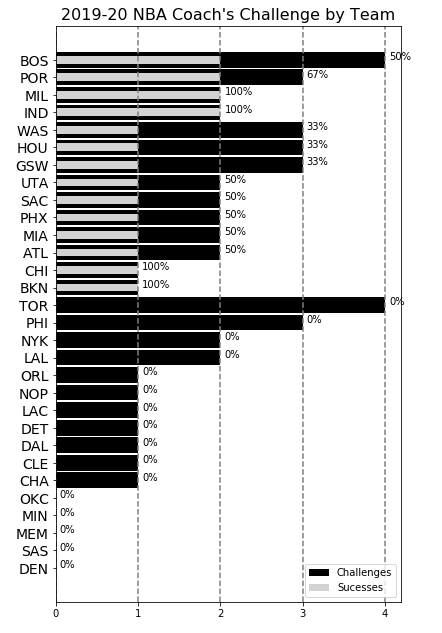
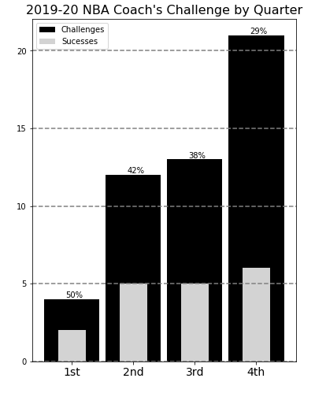

# challenges
Exploratory data analysis of the new NBA challenge rule

## Results

The following includes all NBA regular season games in the 2019-20 season through November 1st.

### Challenges by Team

The figure above shows a wide variety of both challenge usage and success. 5 teams have yet to use the coach's challenge, a peculiar finding given the low cost of a using one, which is only a timeout if the challenge is lost. 14 teams have one or fewer challenge used and no team has used a challenge in all of their games. There seems to be quite an inefficiency in challenge usage so far in the early season.

More than half of the league has yet to win a challenge, indicating that a team's reluctance to use a challenge is not leading to higher success rates. Additionally, only four teams are perfect so far, with Chicago and Brooklyn winning their only challenge and Milwaukee and Indiana winning both of their challenges.

### Challenges by Type

This matches the data from the official NBA site and intuition. Goaltending and out-of-bounds calls are more objective than foul calls, meaning the required evidence for overturning is likely clearer. Called fouls are likely also much more ubiquitous than unlcear out-of-bounds or goaltending violations, which leads to challenges of fouls dominating the totals here. There seems to be two inefficiencies here. One, teams seem to be poor judges on foul calls against them. Two, unclear out-of-bounds reviews happen fairly frequently at the end of games, which could indicate that teams are not challenging these types of calls enough.

### Challenges by Quarter

Again, the above chart shows what one would expect. The volume of challenges increase by quarter. Given the low cost of a challenge, teams should be more willing to challenge a call as the end of the game approaches. Due to this, the probability of success lowers as the quarter increases.

Assuming that the rate of incorrect and challengeable plays is constant throughout a game, perhaps one could expect a more uniform distribution of challenges across quarters. This would suggest that teams are eschewing challenging calls early in the game in favor of saving the challenge should a more impactful situation arise. But given the declining rate of success across the game, these situations either arise less frequently as teams believe or their inability to identify them is poor.

### Challenges by Crew Chief

With so many officials this early in the season, it's tough to garner many takeaways from the above figure. Michael Smith is tied for the lead in challenges and leads all crew chiefs in successful overturns.
